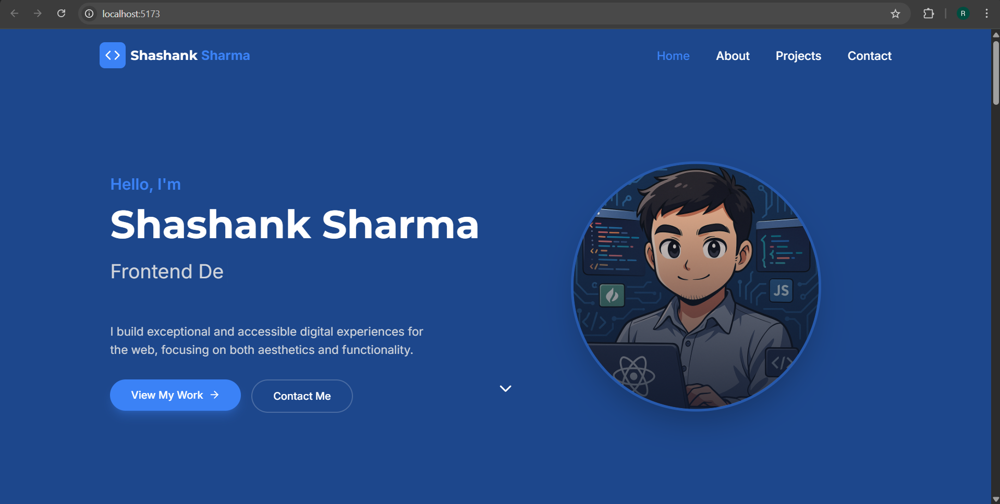
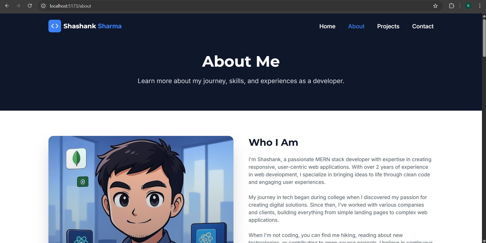
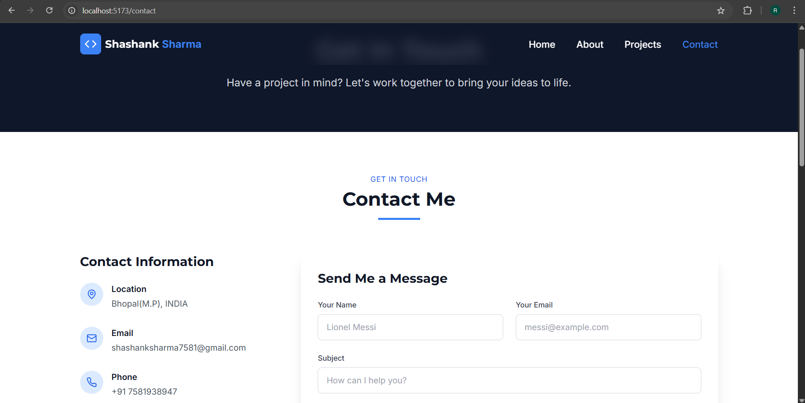

# MyPortfolioTS

## 🌟 Overview

MyPortfolioTS is a modern portfolio website built with:

- **Frontend:** TypeScript, React, React Router Dom, EJS for templating
- **Backend:** Node.js, Express
- **Database:** MongoDB (MERN stack)
- **Styling:** Tailwind CSS / Bootstrap CSS

Explore my projects, track my journey, and discover how I solve real-world problems.

---

## 🚀 Features

- Dynamic routing with React Router
- Interactive components (Contact form, Project cards)
- Fully responsive design across devices
- Modular codebase with TypeScript types
- Easy theming and customization

---

## 📸 Screenshots  

